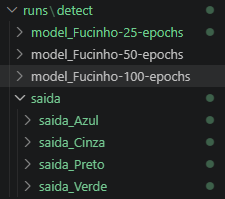
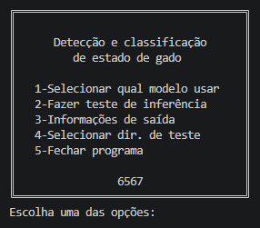
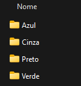

# Visão-Computacional-IC
Visão Computacional para identificação e classificação de focinho de vaca utilizando o modelo YOLO.

* [Quero treinar meu modelo!](#Quero-treinar-meu-modelo!l)

# Como utilizar?

**Existe duas formas** que elaborei para poderem utilizar da melhor forma o que foi desenvolvido; **Primeira:** Você pode utilizar os modelos que foram treinados para o desafio, sendo assim, para utilizar os modelos da YOLO já treinados bastas **seguir os seguintes passos a passos**:

## Instalando as depêndencias

Para a utilização dos modelos, temos que instalar algumas depêndecias. Antes de proseguir verifique ter a instalação completa do python no seu dispositivo.

### Para usuário de Linux:

No terminal da sua IDE digite os seguintes comandos:

```shell
# Execute os seguintes comando em ordem no seu terminal:

# Primeiro: utilizado para cria o ambiente virtual python no seu dir.
python3 -m venv .venv .

# Segundo: Ativa o ambiente virtual no seu terminal atual.
source .venv/bin/activate 

# Utilizar somente quando acabar de utilizar o "mini sofware"
deactivate # Desativa o ambiente virtual no seu terminal atual.

# Terceiro: # Instala a bibilioteca necessaria para o modelo YOLO.
pip install ultralytics 
```

> [AVISO]  
> Certifique de ter o pacote python completo instalado.
>```shell
># Execute no terminal:
>
>sudo apt update
>sudo apt install python3-full
># obtem as seguintes bibliotecas:
>
># python3-dev (cabeçalhos e arquivos para compilar extensões C/C++).
># python3-venv (criação de ambientes virtuais).
># python3-pip (gerenciador de pacotes Python).
># idle3 (IDE simples do Python).
>```

---

### Para usuário de Windows:

No terminal da sua IDE digite os seguintes comandos:

```shell
# Instala a bibilioteca necessaria para o modelo YOLO.
pip install ultralytics
```


> [AVISO]  
> Certifique de ter o pacote **python completo instalado**.
> Acesse o site **https://www.python.org/** e baixe o python ou reinstale caso >tenha dado erro.


## Execução

### Para usuário de Linux:

Para a **execução do "mini sofware"**, basta executar o arquivo chamado **main.py** que se localiza no diretório chamado $./src$.

```shell
# Podendo ser compilado e executado pelo comando:
# Cretifique-se estar no diretório raiz do "mini sofware" e com .venv ativado no seu terminal!

python src/main.py
```

> [AVISO]  
> Cretifique-se estar no diretório ./src e com .venv ativado no seu terminal!
> comando: source .venv/bin/activate 

 O arquivo **inferencia.py** é onde se localiza a função para inferência/predição do modelo. Já o arquivo **train.py** foi usado no google colab para o treinamento do modelo.

---

### Para usuário de Windows:

Para a **execução do "mini sofware"**, basta executar o arquivo chamado **main.py** que se localiza no diretório chamado $./src$.

```shell
# Podendo ser compilado e executado pelo comando:
# Cretifique-se estar no diretório raiz do "mini sofware"

python src/main.py
```

 O arquivo **inferencia.py** é onde se localiza a função para inferência/predição do modelo. Já o arquivo **train.py** foi usado no google colab para o treinamento do modelo.

## Saída e utilidades implementadas:

A saída será gerada no diretório $runs/detect/saida$, contendo a imagens geradas pela inferência/predição do modelo escolhido pelo usúario.

<p align="center">
  
</p>

Quando executar o "mini sofware" aparecerá essa mini interface no seu terminal. A principio é bastante intuitivo sua utilização. Resaltando que para iniciar a inferência deve primeiro selecionar qual modelo deseja usar.

<p align="center">
  
</p>

A **opção $4$ é utilizada para mudar o diretório de teste**, sendo necessario colcar o seu novo grupo de teste na pasta raiz do "mini sofware", depois sendo necessario digitar o nome do novo diretório de teste na opção $4$. Além disso, certifique-se de que seu novo grupo de teste esteja estruturado da seguinte forma:

<p align="center">
  
</p>

> [AVISO]  
> Caso não esteje dessa forma, funcionará do mesmo jeito, mas ficará desorganizado 
> e pode ser gerado 1 pasta para cada imagem.

---

# Quero treinar meu modelo!

**Segunda maneira:** Para o treinamento do **modelo YOLO** será utilizado a plataforma **Google Colab**, uma plataforma na nuvem normalmente utlizada para treinamentos de modelos de IA. Acessando o **link abaixo**, você será redirecionado para a plataforma com os mesmo códigos utilizados para treinar os medelos que contem no "mini sofware" criado para o desafio.

**Link para Google Colab: https://colab.research.google.com/drive/1GvJrHZO3GHHmjxlJTLYlvaDgOyEO-I5o?usp=sharing**

**Você pode se perguntar, porque eu não posso rodar o modelo que eu criei no "mini sofware"?**

> [RESPOSTA]
> Se você colocar o modelo dentro da pasta runs e alterar algumas coisa no código 
> do $main.py$, você conseguira inserir o modelo dentro do "mini sofware", mas isso
> seria mais trabalhoso para executar. A maneira mais inteligente pensada, foi
> utilizar o mesmo código do "mini sofware" para inferência no google colab.


